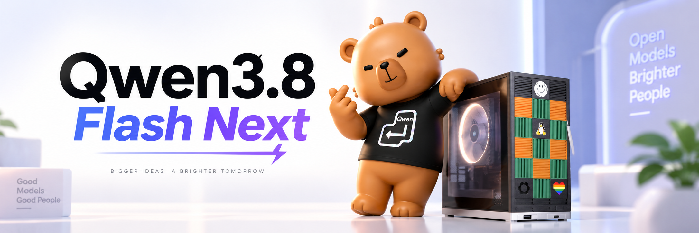

# Qwen 3.8 Flash-Next on Strix Halo



Docker Compose deployment of Qwen 3.8 Flash-Next with MTP speculative
decoding on an AMD Strix Halo box (Ryzen AI MAX+ 395 / Radeon 8060S). The
engine is [drluoto/llama.cpp](https://github.com/drluoto/llama.cpp)
`strix-halo-vulkan`, cloned and built inside the image and pinned to
`ba5354d46`; it is the only build here that loads the FR-Spec MTP head from
[`drluoto/Qwen3.8-Flash-Next-MTP-GGUF`](https://huggingface.co/drluoto/Qwen3.8-Flash-Next-MTP-GGUF).
The repo itself is just the deployment config: one `llama-server` service and
the commands to fetch the weights.


## What is in here

| Path | What it does |
|---|---|
| `docker-compose.yaml` | The `qwen-drluoto-mtp` service: Vulkan/RADV `llama-server` on port `8080`, API key required |
| `drluoto/Dockerfile` | Image for `drluoto/llama.cpp` `strix-halo-vulkan`, pinned to `ba5354d46` |
| `benchmarks/` | `llama-benchy` report and raw results for this service |

## Benchmarks

Measured with [`llama-benchy`](https://github.com/eugr/llama-benchy) against
the running service: 2,048-token prompts, 128 tokens generated, uncached
prefill, mean ± std over three runs. The service runs with MTP speculative
decoding on, so these are MTP numbers, not a draft-off baseline. Single
request:

| Context depth | Prompt processing (t/s) | Generation (t/s) | First response (s) |
|---:|---:|---:|---:|
| 0 | 573.7 ± 4.1 | 40.8 ± 1.9 | 3.70 ± 0.03 |
| 8,192 | 508.0 ± 1.7 | 43.3 ± 2.9 | 20.29 ± 0.07 |
| 32,768 | 408.3 ± 0.4 | 37.7 ± 1.3 | 85.40 ± 0.09 |
| 128,000 | 231.0 ± 0.3 | 25.5 ± 2.0 | 563.18 ± 0.72 |

- Decoding holds ~40 t/s at short context and ~25 t/s at 128K, with the MTP
  head accepting around half of its drafts on this text.
- Uncached prefill is the weak point: a cold 128K prompt takes nearly ten
  minutes. Keep the prefix cache on (the default) and sessions warm — these
  measurements deliberately disable it.
- Two requests share the compute (`--parallel 2`): interactive concurrency is
  only comfortable at short context, and per-request decode falls to ~12 t/s
  at 32K. 128K depth only fits because each slot owns ~132,000 tokens; for one
  full-native-context session, set `--parallel 1`.

Full tables (every depth, both concurrency levels), the exact command lines
and the raw `llama-benchy` output: [`benchmarks/`](benchmarks/).

## Why this branch

The MTP head is an FR-Spec draft: its output vocabulary is trimmed to 65,536
frequency-ranked rows with a `d2t` map back to real token ids. Stock llama.cpp
rejects it for the missing `t2d`/`d2t` tensors, and EngramHalo.cpp does not
read that layout either. Upstream puts it plainly: the draft head "needs this
branch; stock llama.cpp will not load it".

## Requirements

- AMD Strix Halo (Ryzen AI MAX+ 395 / Radeon 8060S, `gfx1151`) with 128 GB
  unified memory — this configuration does not fit in 96 GB.
- ~100 GB free on a local NVMe filesystem. `-lm dio` reads the GGUFs with
  `O_DIRECT`, so no network shares.
- Docker Engine with the Compose plugin, and the `hf` (Hugging Face) CLI.
- The container needs `/dev/dri` (already in the Compose file): RADV talks to
  the GPU through the render node. `/dev/kfd` is not needed.

<details>
<summary>Kernel args this box runs with (from the ROCm setup)</summary>

In `/etc/default/grub`, for a 128 GB host:

```text
amd_iommu=off amdgpu.gttsize=126976 ttm.pages_limit=32505856
```

They size the GTT aperture and the TTM page pool. Tuned for the ROCm path and
not re-measured for Vulkan, but the 90 GiB model plus driver allocations do
not fit without them.

</details>

## Setting up

**1. Pull the weights (~98 GB, 91.5 GiB)** into `~/Models`, which Compose
mounts read-only at `/models`. Keep the layout exactly as written — the server
command line references these paths:

```sh
mkdir -p ~/Models && cd ~/Models

# main model, UD-IQ4_XS (3 shards, ~94 GB)
hf download unsloth/Qwen3.8-Flash-Next-GGUF \
  --local-dir unsloth/Qwen3.8-Flash-Next-GGUF \
  --include "*UD-IQ4_XS*"

# replacement chat template — the server exits if this file is missing
hf download froggeric/Qwen-Fixed-Chat-Templates \
  chat_template.jinja \
  --local-dir froggeric/Qwen-Fixed-Chat-Templates

# FR-Spec MTP head (3.64 GB) — the whole reason for this branch
hf download drluoto/Qwen3.8-Flash-Next-MTP-GGUF \
  mtp-Qwen3.8-Flash-Next-Q8_0-frspec-65k.gguf \
  --local-dir drluoto/Qwen3.8-Flash-Next-MTP-GGUF

# vision head (only needed while the --mmproj lines are in the compose file)
hf download unsloth/Qwen3.8-Flash-Next-GGUF \
  mmproj-BF16.gguf \
  --local-dir unsloth/Qwen3.8-Flash-Next-GGUF
```

Expected result:

```text
~/Models
├── drluoto/Qwen3.8-Flash-Next-MTP-GGUF/mtp-Qwen3.8-Flash-Next-Q8_0-frspec-65k.gguf
├── froggeric/Qwen-Fixed-Chat-Templates/chat_template.jinja
└── unsloth/Qwen3.8-Flash-Next-GGUF
    ├── mmproj-BF16.gguf
    └── UD-IQ4_XS/Qwen3.8-Flash-Next-UD-IQ4_XS-0000{1,2,3}-of-00003.gguf
```

**2. Create an API key (required).** The service passes `--api-key-file` and
mounts `./.api-key` as a Compose secret, so it will not start without the
file, and every `/v1` request needs it as a bearer token:

```sh
umask 077 && openssl rand -base64 48 > .api-key
```

To serve without auth, drop the `--api-key-file` lines and the `secrets:`
entry in `docker-compose.yaml`.

## Running

`qwen-drluoto-mtp` is the only service and has no `profiles:` key, so plain
`docker compose up` starts it. The first build clones and compiles llama.cpp
against Vulkan and takes a while; later starts reuse the image. Loading means
reading ~88 GiB of GGUFs with `O_DIRECT` — give it a few minutes.

```sh
docker compose up -d --build
until curl -sf http://127.0.0.1:8080/health >/dev/null; do sleep 10; done
```

Then smoke-test it (`--list-devices` confirms the GPU, but takes a minute to
init Vulkan):

```sh
KEY=$(cat .api-key)

# docker compose exec qwen-drluoto-mtp llama-server --list-devices
curl -s -H "Authorization: Bearer $KEY" http://127.0.0.1:8080/v1/models

curl -s -H 'Content-Type: application/json' \
  -H "Authorization: Bearer $KEY" \
  http://127.0.0.1:8080/v1/chat/completions \
  -d '{
    "model": "qwen3.8-flash-next-mtp",
    "messages": [{"role": "user", "content": "Hello"}],
    "temperature": 0
  }'
```

Point any OpenAI-compatible client at `http://<host>:8080/v1`, model
`qwen3.8-flash-next-mtp`, same bearer token. `docker compose down` stops the
service.

<details>
<summary>The full server command line</summary>

What `docker-compose.yaml` starts, minus the paths. Server-side sampling
defaults are the template's recommended `temperature` 1.0, `top-k` 20,
`top-p` 0.95, `min-p` 0.0, `presence-penalty` 0.0 — pin `temperature: 0` per
request for greedy.

| Flag | Value | Why |
|---|---|---|
| `-m` | `UD-IQ4_XS` shard `00001` of `00003` | stock quant; the sidecar was trained against the BF16 base |
| `-md` | `mtp-...-Q8_0-frspec-65k.gguf` | FR-Spec MTP draft head |
| `--spec-type` | `draft-mtp` | MTP speculative decoding |
| `--spec-draft-n-max` | `3` | draft up to 3 tokens per step |
| `--spec-draft-p-min` | `0.0` | no probability floor under a draft |
| `--mmproj` | `mmproj-BF16.gguf` | vision head, not part of the validated configuration |
| `--jinja` + `--chat-template-file` | Froggeric fixed template | replaces the template embedded in the GGUF; `--jinja` has to come first |
| `--reasoning-format` | `deepseek` | thoughts are returned as `message.reasoning_content` |
| `--reasoning-preserve` | — | keep the reasoning trace in the whole history, not just the last assistant message |
| `--temperature` / `--top-k` / `--top-p` / `--min-p` / `--presence-penalty` | `1.0` / `20` / `0.95` / `0.0` / `0.0` | the template's recommended sampler, pinned explicitly including where it matches the server default |
| `-ngl` | `999` | full offload |
| `-fa` | `on` | flash attention |
| `-b` / `-ub` | `2048` / `2048` | batching from the validated host run |
| `-c` | `264000` | shared context |
| `--parallel` | `2` | two slots, ~132,000 tokens each |
| `--ctx-checkpoints` | `8` | lets the parallel slots rotate |
| `-ctk` / `-ctv` | `f16` / `f16` | full-precision K/V; a quantised cache costs acceptance |
| `-lm` | `dio` | model loading mode (`-lm` is `--load-mode`) |
| `--no-webui` | — | API only |
| `--host` / `--port` | `0.0.0.0` / `8080` | in-container bind; see the published port below |
| `--api-key-file` | `/run/secrets/qwen_api_key` | bearer token from `./.api-key` |
| `--alias` | `qwen3.8-flash-next-mtp` | OpenAI model name |

</details>

## Notes and limitations

- Everything here is tuned for one machine (128 GB, NVMe, CPU governor
  `powersave`). Retune before trusting it elsewhere.
- The published port is `0.0.0.0:8080:8080`, so the API key is the only thing
  in front of it. Use `127.0.0.1:8080:8080` for localhost-only, and do not
  remove `--api-key-file` while it listens on a LAN address.
- Two settings are load-bearing: `GGML_VK_DISABLE_GDN_CACHE_FUSION=1` avoids a
  fused state-cache kernel that corrupts output on the 8060S, and `-lm dio`
  needs `O_DIRECT` — never combine it with `--no-mmap`.
- The served chat template is Froggeric's fixed file, not the one embedded in
  the GGUFs: download it or the server exits at startup, and keep `--jinja`
  ahead of it. `--reasoning-preserve` does nothing unless the template
  advertises `supports_preserve_reasoning`.
- The vision head is along for the ride and unproven on this branch — the
  workloads are text-only and nothing under `tools/mtmd` mentions the
  `qwen4exp` arch. If the server dies on `model does not support vision
  input`, drop the two `--mmproj` lines.
- Vulkan is the only path left. The ROCm/HIP profiles built on
  [EngramHalo.cpp](https://github.com/Aristo94/EngramHalo.cpp) were removed;
  upstream reports Vulkan as a net loss against a stock RADV build, and no
  ROCm comparison was done here.
- The fork's own timing tooling (`run-bench.sh`, the `/opt/bench/spektrum.py`
  replay, the `llama-bench` target) is not in the image. The numbers in this
  README come from `llama-benchy` against the HTTP API — measure your own.
- `setup.sh` / `setup.py` are ROCm-era and only in git history. Follow this
  README for the weights.
- No license file yet.

## Acknowledgements

- [drluoto/llama.cpp](https://github.com/drluoto/llama.cpp) —
  `strix-halo-vulkan`, the MTP head and the state-cache work.
- [drluoto/Qwen3.8-Flash-Next-MTP-GGUF](https://huggingface.co/drluoto/Qwen3.8-Flash-Next-MTP-GGUF)
  — the FR-Spec MTP draft head this service serves.
- [unsloth/Qwen3.8-Flash-Next-GGUF](https://huggingface.co/unsloth/Qwen3.8-Flash-Next-GGUF)
  — model and mmproj.
- [froggeric/Qwen-Fixed-Chat-Templates](https://huggingface.co/froggeric/Qwen-Fixed-Chat-Templates)
  — the fixed chat template the server requires, and the recommended sampling
  parameters it pins.
- [Aristo94/EngramHalo.cpp](https://github.com/Aristo94/EngramHalo.cpp) — the
  Strix Halo patch series and the
  [setup docs](https://github.com/Aristo94/EngramHalo.cpp/tree/strix-halo-qwen4exp/docs/strix-halo)
  this config grew out of.
